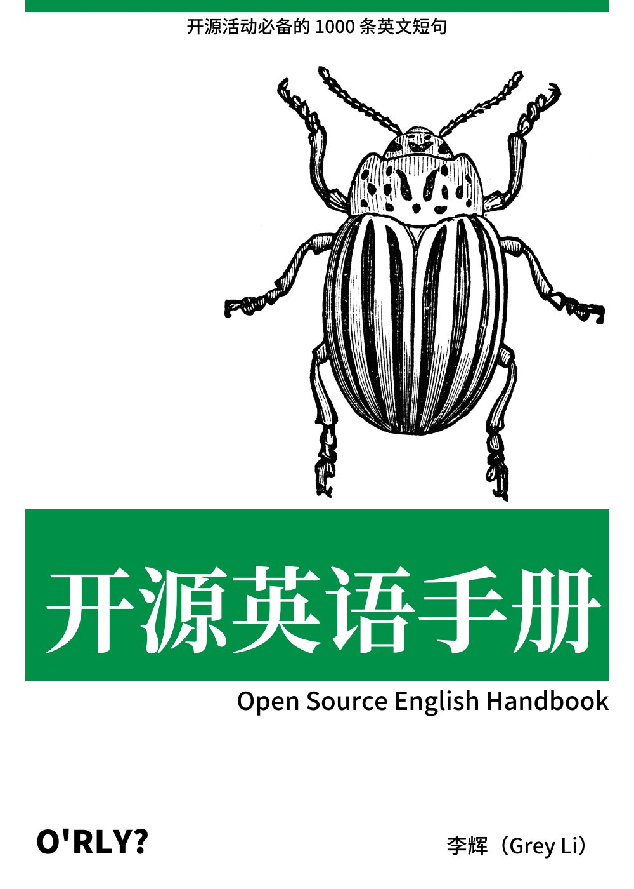

# OSEnglish

> 开源英语手册（Open Source English Handbook）：开源活动常用的英文短句和用法。

<small>Cover generated by [O'RLY Cover Generator](https://github.com/nanmu42/orly).</small>

## Content

- [issue.md](./content/issue.md) Issue 活动用语
- [pr.md](./content/pr.md) Pull Request 活动用语
- [discuss.md](./content/discuss.md) 一般的讨论用语
- [abbr.md](./content/abbr.md) 常见缩写含义和用法

## Todo

- 对内容进行分类（按照场景：提交、讨论和管理）
- 添加更多常用语
- 生成 HTML 页面，并在左侧显示大纲（考虑使用静态站点生成器）
- 悬停显示中文翻译
- 为每一行添加点击复制按钮（clipboard.js)
- 提供 PDF 下载

## Contribute

欢迎贡献更多内容或修复错误。
